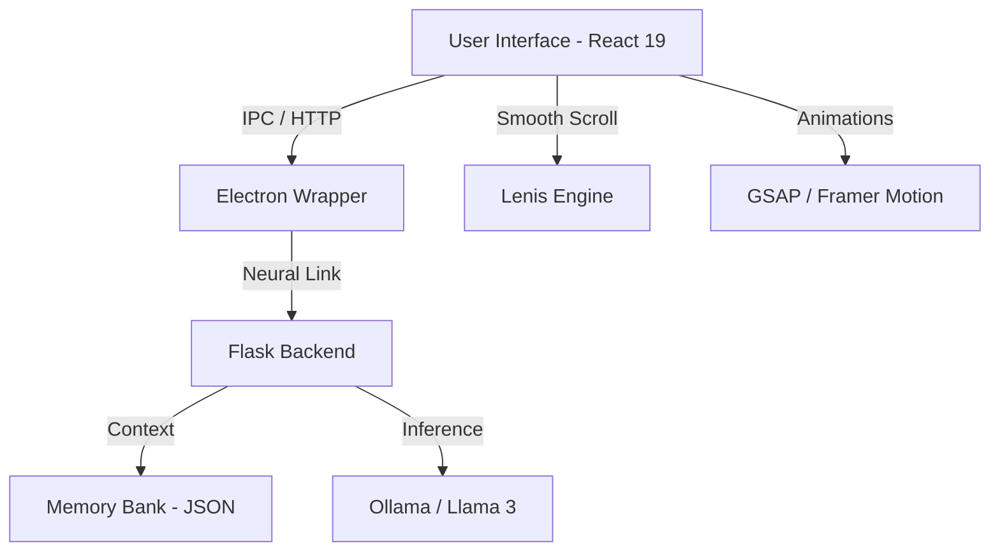

# 🦾 JARVIS: MARK VII NEURAL INTERFACE
> **The ultimate AI companion with a liquid-glass aesthetic and a high-performance neural backbone.**

[](https://github.com/niranjandascp/Moltbot)
[](https://github.com/niranjandascp/Moltbot)
[](LICENSE)

---

## 📖 Overview
JARVIS (Just A Rather Very Intelligent System) is a high-end, frameless AI command center. It bridges the gap between local LLM power and cinematic UI design. Built for high-performance interaction, it features a **Liquid Glass** design system inspired by the next generation of Apple's OS.

### 🏗️ Architecture


---

## 💎 Features
- **🧠 Neural Persistence**: Atomic memory management with absolute path resolution.
- **🌊 Liquid Glass Design**: 40px backdrop-blur, 200% saturation, and interactive spotlights.
- **🖥️ Native OS Integration**: Frameless window with macOS Traffic Lights (Close, Min, Max).
- **🎙️ Advanced Voice Hub**: Integrated speech recognition and high-fidelity server-side synthesis.
- **🌊 Momentum Scrolling**: Industry-standard smooth scrolling via Lenis.
- **🐳 Docker Ready**: Optimized multi-stage containerization for instant deployment.

---

## 🛠️ Tech Stack
| Tier | Technology |
| :--- | :--- |
| **Frontend** | React 19, GSAP, Framer Motion, Lenis |
| **Backend** | Python 3.9, Flask, pyttsx3 |
| **Neural** | Ollama API (Llama 3 Model) |
| **Environment** | Electron (Native Bridge), Docker & Compose |
| **Styling** | Vanilla CSS (Liquid Glass System) |

---

## 🚀 Installation & Setup

### 📋 Prerequisites
- **Node.js**: v18.0.0 or higher
- **Python**: v3.9 or higher
- **Docker**: (Optional) For containerized deployment
- **Ollama**: Required for local LLM inference ([Download Ollama](https://ollama.com))

---

### 📦 Option 1: Native Desktop (Recommended)
1. **Clone & Setup Backend**:
   ```bash
   git clone https://github.com/niranjandascp/Moltbot.git
   cd moltbot
   pip install -r requirements.txt
   ```
2. **Setup Frontend**:
   ```bash
   cd frontend
   npm install
   ```
3. **Launch JARVIS**:
   ```bash
   npm run electron
   ```
   *The system will automatically initialize the neural core and sync all ports.*

---

### 🐳 Option 2: Docker Deployment (Professional)
Deploy the full stack in an isolated, high-security container.

1. **Install Docker Desktop**: [Download here](https://www.docker.com/products/docker-desktop/)
2. **Build and Start**:
   ```bash
   docker-compose up --build
   ```
3. **Access JARVIS**:
   - **UI**: `http://localhost:3000`
   - **Neural API**: `http://localhost:5000`

---

## ⚓ Window Management
| Action | Interface Control |
| :--- | :--- |
| **Reposition** | Grab the **top 35px** of the glass header and drag. |
| **Minimize** | Click the **🟡 Yellow** traffic light. |
| **Maximize** | Click the **🟢 Green** traffic light. |
| **Shutdown** | Click the **🔴 Red** traffic light (Terminates all neural processes). |

---

## 🔧 Troubleshooting
- **Stuck on Loading?**: Ensure the backend (Port 5000) and frontend (Port 3000) are not blocked by your firewall.
- **No Response?**: Verify that the **Ollama** service is running and the `llama3` model is pulled (`ollama pull llama3`).
- **Memory Error?**: The system automatically creates `memory.json`. If permissions fail, ensure the app has write access to the `backend/` directory.

---

## 📜 License & Support
This project is licensed under proprietary Stark Industries protocols. 
For support or neural recalibration, please contact the lead developer.

**"Neural link established. Systems are at 100%, Sir."**
